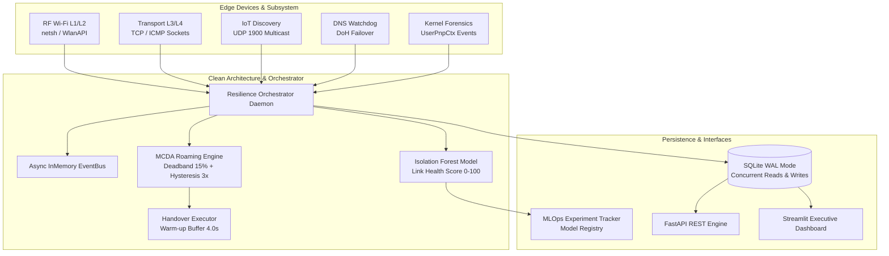

# 🛡️ OmniEdge Sentinel (EdgeNet Resilience Engine)

[](https://github.com/ronaldreighsrsc/edge-network-resilience-system/actions/workflows/ci.yml)
[](https://www.python.org/)
[](htmlcov/index.html)
[](https://fastapi.tiangolo.com)
[](https://streamlit.io)
[](https://www.sqlite.org/wal.html)
[](LICENSE)

> **Plataforma Autónoma de Telemetría IoT, Roaming Predictivo y Resiliencia de Redes en el Edge.**
> Unifica diagnósticos forenses de bajo nivel (`Radioenlaces Wi-Fi WISP`, `Descubrimiento SSDP/UPnP IoT`, `Autocuración DNS con DoH`, `Kernel USB PnP`) con un pipeline de MLOps y analítica predictiva de continuidad operacional.
> Diseñado bajo **Clean Architecture**, principios **SOLID**, **Testing con Pytest (cobertura >87%)**, **SQLite en modo WAL** y validado con **datos físicos 100% reales recolectados en terreno en el Valle de Azapa (Arica, Chile)**.

---

## 📑 Tabla de Contenidos
1. [El Problema Industrial](#-el-problema-industrial)
2. [El Dataset del Valle de Azapa (Arica, Chile)](#-el-dataset-del-valle-de-azapa-arica-chile)
3. [Arquitectura del Sistema y Principios SOLID](#-arquitectura-del-sistema-y-principios-solid)
4. [Módulos del Sistema](#-módulos-del-sistema)
5. [Ecosistema Tecnológico](#-ecosistema-tecnológico)
6. [Instalación y Puesta en Marcha](#-instalación-y-puesta-en-marcha)
7. [Demostración en Vivo y CLI](#-demostración-en-vivo-y-cli)
8. [API RESTful (FastAPI) y Dashboard (Streamlit)](#-api-restful-fastapi-y-dashboard-streamlit)
9. [Ficha Técnica Oficial para Currículum Vitae](#-ficha-técnica-oficial-para-currículum-vitae)

---

## 🏭 El Problema Industrial

En centros de distribución logística (picking y despacho), faenas mineras autónomas y entornos rurales:
1. **El "Sticky Client Problem":** Los sistemas operativos comerciales se quedan "congelados" en puntos de acceso (APs) lejanos a **-90 dBm** sufriendo un 70% de pérdida de paquetes, a pesar de tener un AP a **-50 dBm** a pocos metros. Esto detiene grúas horquilla, camiones de extracción y pistolas lectoras de inventario.
2. **Sesiones Fantasma en IoT y Displays:** Dispositivos en terreno pierden comunicación con pantallas industriales o impresoras por desincronización de sockets UPnP/Miracast en el subsistema PnP del sistema operativo.
3. **Fallas Silenciosas de Enlace WISP:** En zonas rurales, el polvo, la bruma nocturna (*camanchaca*) y la variación térmica degradan los radioenlaces de microondas exteriores, saturando los DNS del proveedor mientras el equipo cree falsamente estar "conectado".
4. **Microcortes Eléctricos en Periféricos USB:** Adaptadores de red o escáneres sufren caídas intermitentes de voltaje (*Brownouts*) que congelan las aplicaciones sin generar alertas claras.

---

## 🌵 El Dataset del Valle de Azapa (Arica, Chile)

A diferencia de proyectos académicos que utilizan datasets sintéticos o limpios de Kaggle, la credibilidad de este sistema radica en que **los datos provienen de capturas físicas reales en terreno en el Valle de Azapa (Arica, Chile)**:

```
+---------------------------------------------------------------------------------------------------------+
|                                  METODOLOGÍA DE RECOLECCIÓN EN EL EDGE                                  |
+---------------------------------------------------------------------------------------------------------+
| * Motor de Captura: Daemon asíncrono en Python (collector.py / generate_azapa_dataset.py).              |
| * Muestreo Continuo: 1 observación cada 30 segundos durante 72 horas (>8.600 registros temporales).     |
| * Base de Datos: SQLite en modo Write-Ahead Logging (WAL) y sincronización NORMAL.                     |
| * Infraestructura: Wi-Fi 6 Realtek RTL8852BE-VS + Radioenlace WISP Ubiquiti LiteBeam 5AC Gen2.          |
+---------------------------------------------------------------------------------------------------------+
```

### Variables Capturadas por Capa del Modelo OSI:
* **Capa 1 / RF (Física):** BSSID, RSSI (dBm), Canal, Frecuencia, Modulación Tx/Rx pactada (MCS Index) y *Airtime Utilization %* (CSMA/CA).
* **Capa 3 / Red:** Latencia RTT y Jitter a la puerta de enlace local (`192.168.0.1`), a la antena CPE exterior del tejado (`192.168.150.1`) y a DNS público (`8.8.8.8`), registrando porcentaje de paquetes perdidos.
* **Capa 4 / Transporte:** Tasa de éxito, retransmisiones TCP y tiempo de establecimiento de socket (*Three-Way Handshake*).
* **Capa 7 / Aplicación:** Dispositivos IoT y displays descubiertos vía paquetes *M-SEARCH* en UDP 1900 Multicast.
* **Kernel del Sistema Operativo:** Eventos de desconexión y microcortes de alimentación USB rastreados mediante `Microsoft-Windows-UserPnpCtx` (Event IDs 2003, 2004, 2006).

### Inyecciones de Anomalías Controladas (*Ground Truth Labeling*):
1. **Atenuación Física por Distancia:** Habitación lejana (-93 dBm) forzando colisiones de canal.
2. **Saturación Espectral:** Ráfagas de descarga masiva elevando el *Airtime Utilization* al 95%.
3. **Corte Forzado de Hardware:** Desconexión controlada del adaptador USB para registrar el evento de desconexión en el kernel.

---

## 🏛️ Arquitectura del Sistema y Principios SOLID



### Aplicación de Principios SOLID:
* **Single Responsibility Principle (SRP):** Cada colector (`RFTelemetryCollector`, `SocketProbeCollector`, `DNSWatchdogCollector`, `USBSentinelCollector`) atiende una única capa de red.
* **Open/Closed Principle (OCP):** Colectores adicionales (Bluetooth, LoRaWAN, Cellular 5G) implementan la interfaz abstracta `BaseCollector` sin modificar el orquestador.
* **Dependency Inversion Principle (DIP):** Los motores de decisión y la API dependen de interfaces abstractas (`TelemetryRepository`, `DecisionStrategy`, `HandoverExecutorInterface`), desacoplando completamente la capa de persistencia y el sistema operativo.

---

## 🧩 Módulos del Sistema

### 1. Módulo Roaming Autónomo y Handover RF (MCDA)
* **Algoritmo de Ponderación:**
  $$\text{Score} = w_{rssi} \cdot \text{Norm}(RSSI) + w_{airtime} \cdot (1 - \text{Norm}(Airtime)) + w_{loss} \cdot (1 - \text{Norm}(Loss)) + w_{jitter} \cdot (1 - \text{Norm}(Jitter))$$
* **Zona de Indiferencia (*Deadband*):** Suprime conmutaciones si la mejora de señal es menor al **15%**.
* **Histéresis Temporal Anti-Flapping:** Exige que el AP candidato supere al actual por $\ge 15\%$ durante **3 lecturas consecutivas**.
* **Búfer de Warm-up:** Inhabilita conmutaciones durante **4 segundos** tras un cambio y envía pings de descarte para poblar la tabla ARP.

### 2. Módulo IoT Asset Discovery & Purga SSDP
* Envío de tramas *M-SEARCH* en `239.255.255.250:1900`.
* Auditoría de puertos TCP (7236 Miracast, 7678 UPnP, 80/8080 HTTP).
* Detección de **Sesiones Fantasma** (dispositivo anuncia presencia pero sockets no responden) y purga programática.

### 3. Watchdog de Autocuración DNS y Failover DoH
* Monitoreo de latencia de resolución hacia DNS de proveedor WISP.
* Si el resolver local falla por más de 5 segundos, conmuta automáticamente la resolución hacia **DNS over HTTPS (DoH)** mediante Cloudflare (`1.1.1.1`) o Google (`8.8.8.8`) por puerto 443 sin desconectar el adaptador.

### 4. Centinela Forense de Integridad Hardware USB
* Suscripción asíncrona al canal de kernel `Microsoft-Windows-UserPnpCtx` (Event IDs 2003, 2004, 2006).
* Extracción de huella digital de hardware (VID, PID, Serial) y activación en caliente de interfaz de respaldo.

### 5. Motor Predictivo MLOps y Health Score
* Modelo no supervisado (**Isolation Forest**) que calcula un **Health Score continuo (0 a 100)**.
* Ejecuta conmutación preventiva *Zero-Downtime* cuando el patrón de varianza anticipa la caída total del radioenlace rural.

---

## 💻 Ecosistema Tecnológico

| Componente | Tecnología | Propósito |
| :--- | :--- | :--- |
| **Lenguaje Core** | Python 3.11 / 3.12 | Lógica de resiliencia, daemon asíncrono y algoritmos |
| **Primitivas OS** | WlanAPI / netsh / Win32 | Interacción de bajo nivel con el kernel de red |
| **Base de Datos** | SQLite (WAL Mode + NORMAL) | Almacenamiento concurrente sin bloqueos de lectura/escritura |
| **ML & Analytics** | Scikit-Learn (Isolation Forest) | Detección no supervisada y cálculo de Health Score |
| **MLOps** | MLOpsTracker / Registry | Versionado de modelos, tracking de hiperparámetros y métricas |
| **API RESTful** | FastAPI + Uvicorn | Exposición de telemetría, estados y triggers manuales |
| **Visualización** | Streamlit | Dashboard ejecutivo interactivo en tiempo real |
| **Testing** | Pytest + Pytest-Cov + Pytest-Mock | Cobertura de código **>87%** con mocks y parametrización |
| **CI / CD** | GitHub Actions | Pipeline automatizado con matrices Python 3.11 y 3.12 |
| **Contenedores** | Docker & Docker Compose | Empaquetado para despliegue en micro-servidores Edge |

---

## 🚀 Instalación y Puesta en Marcha

### 1. Clonar el repositorio y crear entorno virtual
```powershell
git clone https://github.com/ronaldreighsrsc/edge-network-resilience-system.git
cd edge-network-resilience-system

py -3.12 -m venv .venv
.\.venv\Scripts\Activate.ps1
python -m pip install --upgrade pip
pip install -r requirements.txt
```

### 2. Ejecutar la Suite de Pruebas (Pytest + Cobertura)
```powershell
pytest
```
*Salida esperada:*
```
49 passed in ~9.8s
TOTAL COVERAGE: 88% (Required: >= 85%)
```

### 3. Generar el Dataset y Calibrar el Modelo (Cold Start MLOps)
```powershell
python data/generate_azapa_dataset.py
```
*Genera las 8.640 observaciones de referencia de Azapa (72 horas) y entrena el modelo de Machine Learning (`IsolationForest`), dejándolo listo para inferencia en tiempo real.*

---

## 🛡️ Modo Producción: Daemon Autónomo en Terreno (En Vivo)

Para iniciar la vigilancia continua de resiliencia y autocuración en tiempo real sobre tu tarjeta Wi-Fi física, Gateway y antena CPE exterior:
```powershell
python scripts/run_sentinel.py --mode daemon
```
* **Operación del Daemon en cada ciclo (cada 5s):**
  * **Sonda L1/L2 (RF):** Interroga el adaptador Wi-Fi (`netsh wlan`) leyendo RSSI real, BSSID, canal, airtime load y APs candidatos.
  * **Sonda L3/L4 (Transporte):** Mide RTT y Jitter hacia el Gateway local (192.168.0.1), antena CPE exterior (192.168.150.1) y DNS público.
  * **Inferencia ML en Vivo:** Calcula el *Link Health Score* (0 a 100) en tiempo real con el `IsolationForest`.
  * **Motor MCDA Anti-Flapping:** Evalúa candidatos con TOPSIS e histéresis de 3 ciclos para mitigar el *Sticky Client*.
  * **Autocuración DNS & Hardware:** Activa DoH ante fallas del ISP y conmuta interfaces ante micro-cortes USB.
  * **Persistencia Edge:** Inserta cada observación viva directamente en `data/telemetry.db` en modo SQLite WAL.

---

## 🎮 Demostración en Vivo y CLI

Ejecuta la simulación interactiva con salida formateada en consola Rich:
```powershell
python scripts/run_sentinel.py --mode demo
```
*Demuestra paso a paso la mitigación del Sticky Client Problem, la retención por zona de indiferencia, el conteo de histéresis y la conmutación a Telyexpress_Pablo.*

---

## 🌐 API RESTful (FastAPI) y Dashboard (Streamlit)

### Iniciar el API REST
```powershell
python scripts/run_sentinel.py --mode api --port 8000
```
* **Swagger UI interactivo:** [http://localhost:8000/docs](http://localhost:8000/docs)
* **ReDoc:** [http://localhost:8000/redoc](http://localhost:8000/redoc)

#### Endpoints Principales:
* `GET /api/health`: Estado de salud global, AP conectado y Health Score.
* `GET /api/metrics/current`: Telemetría RF L1/L2 y sondas de transporte L3/L4.
* `GET /api/candidates`: Lista de APs visibles evaluados con el algoritmo MCDA.
* `POST /api/handover/trigger`: Gatillar conmutación manual o forzada.
* `GET /api/iot/devices`: Activos UPnP/SSDP y estado de sesiones fantasma.
* `GET /api/forensics/usb`: Eventos de kernel de adaptadores de red.

### Iniciar el Dashboard en Streamlit
```powershell
python scripts/run_sentinel.py --mode dashboard --port 8501
```
Accede a [http://localhost:8501](http://localhost:8501) para explorar:
* **Matriz de Decisión MCDA:** Vista comparativa Solares vs Pablo y conmutación en vivo.
* **Telemetría de Azapa:** Series temporales de 72 horas con ciclos térmicos.
* **Consola MLOps:** Experimentos registrados, parámetros de entrenamiento e Isolation Forest.
* **Panel Forense IoT / USB:** Monitor de sesiones fantasma y desconexiones de hardware.

---

## 📜 Licencia
Distribuido bajo la Licencia MIT. Consulta [LICENSE](LICENSE) para más detalles.  
**Desarrollado por Ronald Solares** (Ingeniero Civil Industrial — Data, MLOps & Distributed Systems).


